# 📊 Fluxogramas de Processo - ERP PLANAC

Diagramas visuais dos principais processos do sistema.

---

## Índice de Fluxogramas

| # | Fluxo | Módulo | Status |
|---|-------|--------|--------|
| 1 | Venda Completa (com entregas fracionadas) | Comercial | ✅ |
| 2 | Orçamento (mesclar/desmembrar) | Comercial | ✅ |
| 3 | Uso de Crédito na Venda | Comercial | ✅ |
| 4 | Devolução de Venda | Comercial | ✅ |
| 5 | Troca de Venda | Comercial | ✅ |
| 6 | Consignação | Comercial | ✅ |
| 7 | Compra Completa | Compras | ✅ |
| 8 | Fluxo Financeiro (Recebimento) | Financeiro | ✅ |
| 9 | E-commerce B2B | E-commerce | ✅ |
| 10 | E-commerce B2C | E-commerce | ✅ |
| 11 | Entrega com Rastreamento GPS | Expedição | ✅ |
| 12 | Garantia de Produtos | Comercial | ✅ |

---

## 1. Fluxo de Venda Completa

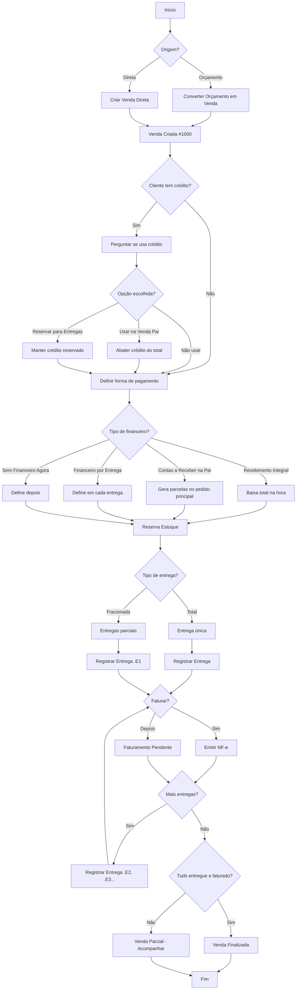

---

## 2. Fluxo de Orçamento (Mesclar/Desmembrar)

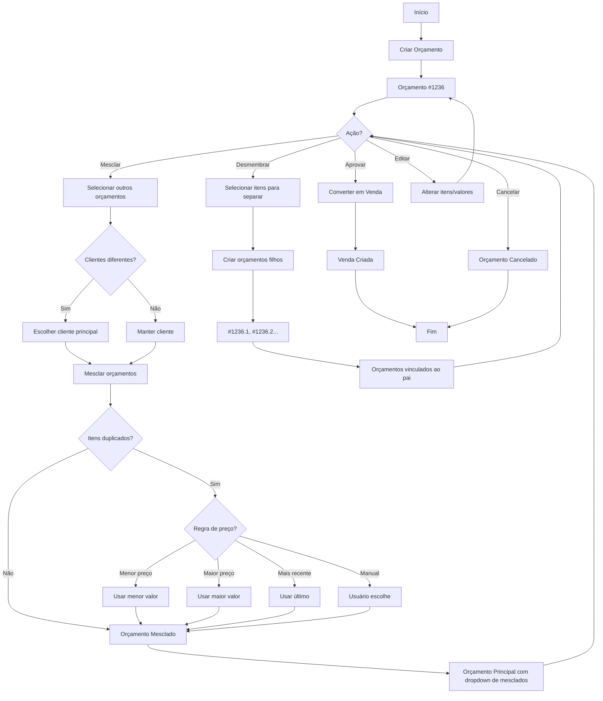

---

## 3. Fluxo de Uso de Crédito na Venda

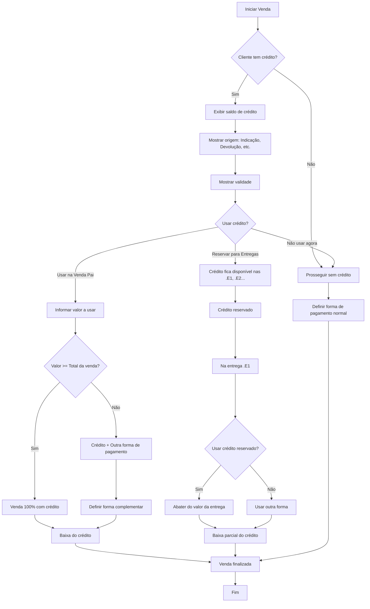

---

## 4. Fluxo de Devolução de Venda

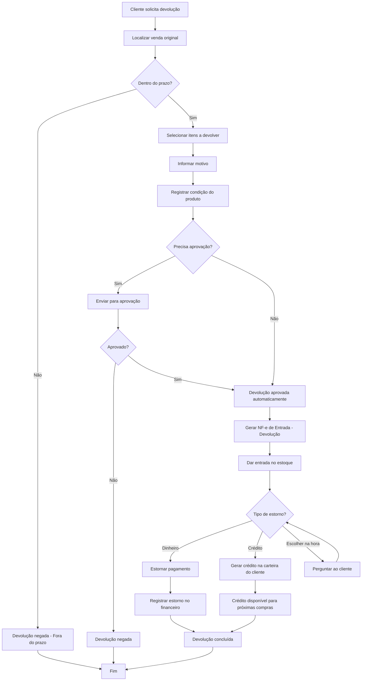

---

## 5. Fluxo de Troca de Venda

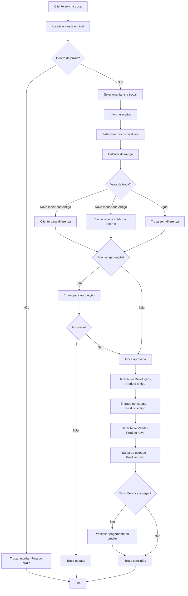

---

## 6. Fluxo de Consignação

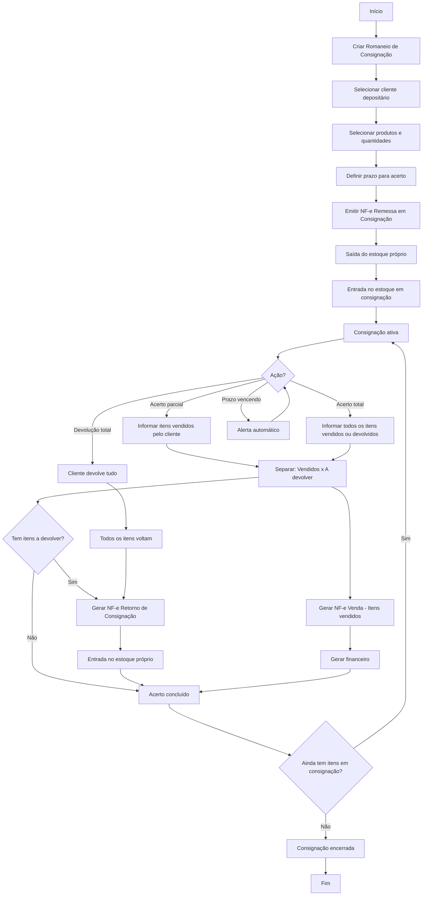

---

## 7. Fluxo de Compra Completa

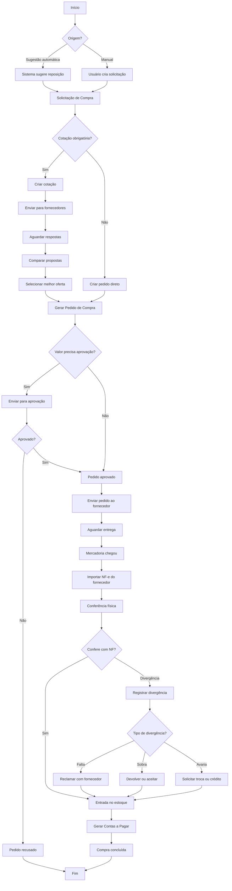

---

## 8. Fluxo Financeiro - Recebimento

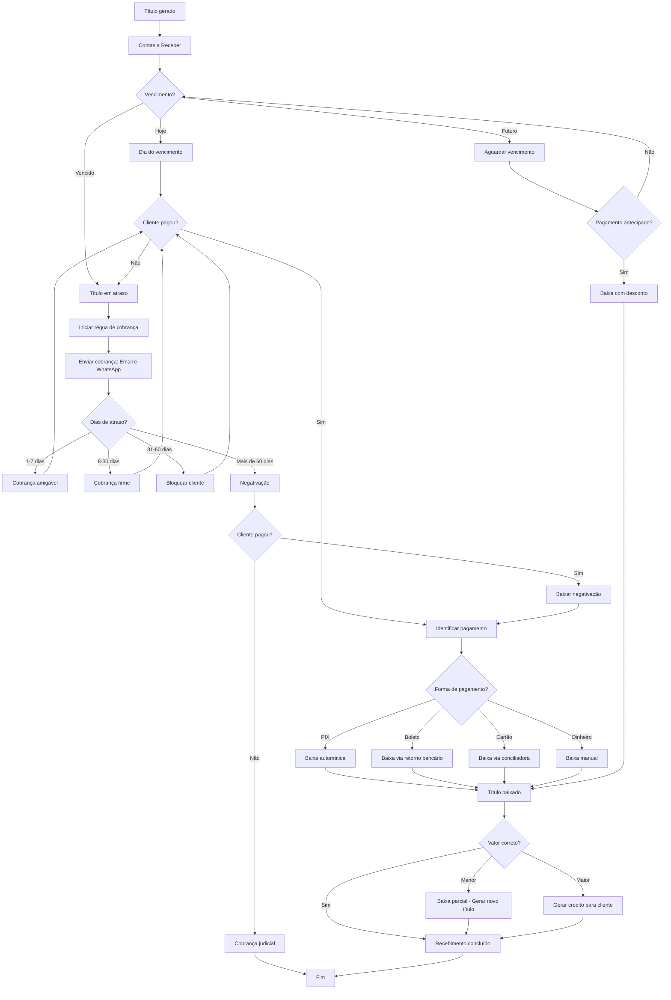

---

## 9. Fluxo E-commerce B2B

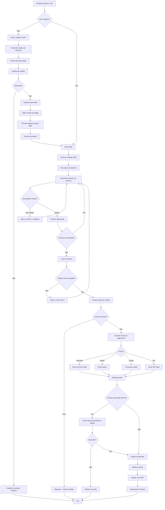

---

## 10. Fluxo E-commerce B2C

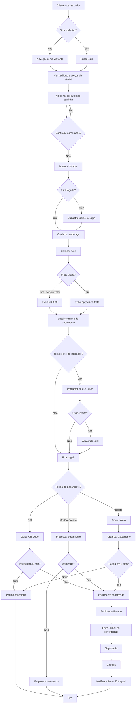

---

## 11. Fluxo de Entrega com Rastreamento GPS

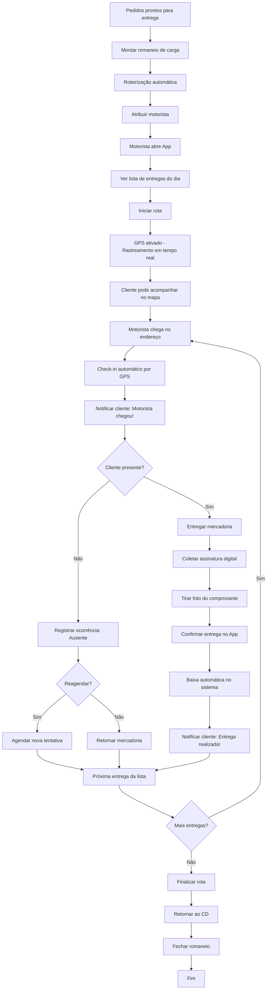

---

## 12. Fluxo de Garantia de Produtos

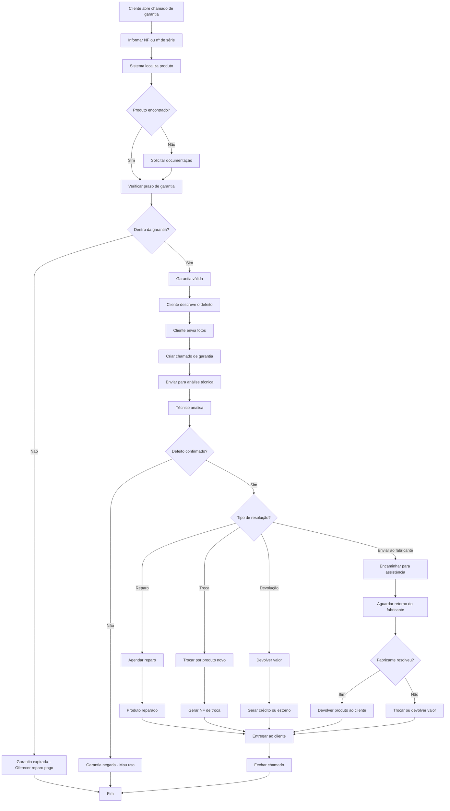

---

## Legenda dos Diagramas

| Símbolo | Significado |
|---------|-------------|
| Retângulo arredondado | Início / Fim |
| Retângulo | Processo / Ação |
| Losango | Decisão |
| Seta | Fluxo / Direção |

---

## Próximos Fluxogramas a Criar

- [ ] Fluxo de Produção (PCP)
- [ ] Fluxo de Inventário
- [ ] Fluxo de RH (Admissão)
- [ ] Fluxo de RH (Folha de Pagamento)
- [ ] Fluxo de Contratos
- [ ] Fluxo de Precificação

---

Última atualização: 29/11/2025

PLANAC Distribuidora - ERP - Documentação Oficial
